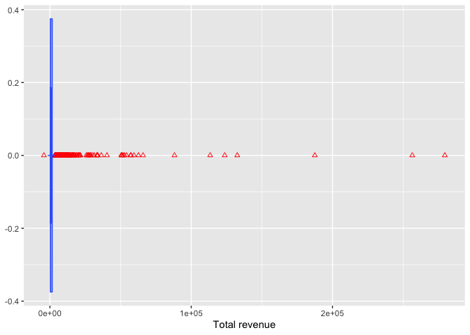

High value customers identification using K-Means clustering
================
Sayorn Chin
06/10/2021

### 1. Problem statement

A UK-based online retail store has captured the sales data for different
products for the period of one year (Nov 2016 to Dec 2017). The
organization sells gifts primarily on the online platform. The customers
who make a purchase consume directly for themselves. There are small
businesses that buy in bulk and sell to other customers through the
retail outlet channel.

### 2. Project objective

This project aims to find significant customers for the business who
make high purchases of their favourite products. The organization wants
to roll out a loyalty program to the high-value customers after
identification of segments. I use the clustering methodology to segment
customers into groups.

### 3. Data and method

#### 3.1 Data

``` r
## Required R libraries
load_libraries <- function(){
  library(usdm)
  library(sp)
  library(raster)
  library(dplyr)
  library(ggplot2)
  library(cluster)
  library(purrr)
  library(tidyverse)
  library(factoextra)
  library(DataExplorer)
  library(gridExtra)
  library(lubridate)
  library(NbClust)
  library(countrycode)
print("The libraries are loaded.")
}
load_libraries()
```

    ## [1] "The libraries are loaded."

``` r
## Set working directory
setwd("/Users/schinlfc/data-science-R/e-commerce-clustering/data")

## Load dataset
ecommerce <- read.csv("Ecommerce.csv")

## Data preprocessing
# View the structure of the data frame
str(ecommerce)
```

    ## 'data.frame':    541909 obs. of  9 variables:
    ##  $ InvoiceNo  : chr  "536365" "536365" "536365" "536365" ...
    ##  $ StockCode  : chr  "85123A" "71053" "84406B" "84029G" ...
    ##  $ Description: chr  "WHITE HANGING HEART T-LIGHT HOLDER" "WHITE METAL LANTERN" "CREAM CUPID HEARTS COAT HANGER" "KNITTED UNION FLAG HOT WATER BOTTLE" ...
    ##  $ Quantity   : int  6 6 8 6 6 2 6 6 6 32 ...
    ##  $ InvoiceDate: chr  "29-Nov-16" "29-Nov-16" "29-Nov-16" "29-Nov-16" ...
    ##  $ UnitPrice  : num  2.55 3.39 2.75 3.39 3.39 7.65 4.25 1.85 1.85 1.69 ...
    ##  $ CustomerID : int  17850 17850 17850 17850 17850 17850 17850 17850 17850 13047 ...
    ##  $ Country    : chr  "United Kingdom" "United Kingdom" "United Kingdom" "United Kingdom" ...
    ##  $ X          : logi  NA NA NA NA NA NA ...

``` r
# View basic summary statistics
summary(ecommerce)
```

    ##   InvoiceNo          StockCode         Description           Quantity        
    ##  Length:541909      Length:541909      Length:541909      Min.   :-80995.00  
    ##  Class :character   Class :character   Class :character   1st Qu.:     1.00  
    ##  Mode  :character   Mode  :character   Mode  :character   Median :     3.00  
    ##                                                           Mean   :     9.55  
    ##                                                           3rd Qu.:    10.00  
    ##                                                           Max.   : 80995.00  
    ##                                                                              
    ##  InvoiceDate          UnitPrice           CustomerID       Country         
    ##  Length:541909      Min.   :-11062.06   Min.   :12346    Length:541909     
    ##  Class :character   1st Qu.:     1.25   1st Qu.:13953    Class :character  
    ##  Mode  :character   Median :     2.08   Median :15152    Mode  :character  
    ##                     Mean   :     4.61   Mean   :15288                      
    ##                     3rd Qu.:     4.13   3rd Qu.:16791                      
    ##                     Max.   : 38970.00   Max.   :18287                      
    ##                                         NA's   :135080                     
    ##     X          
    ##  Mode:logical  
    ##  NA's:541909   
    ##                
    ##                
    ##                
    ##                
    ## 

``` r
# View number of rows and columns
dim(ecommerce)
```

    ## [1] 541909      9

``` r
# Find the number of missing values in the rows and columns
namat <- is.na(ecommerce)
table(rowSums(namat))
```

    ## 
    ##      1      2 
    ## 406829 135080

``` r
# Find the total number of missing values in each column
colSums(namat)
```

    ##   InvoiceNo   StockCode Description    Quantity InvoiceDate   UnitPrice 
    ##           0           0           0           0           0           0 
    ##  CustomerID     Country           X 
    ##      135080           0      541909

``` r
# The alternative way to find the the number of missing values in each column
naecommerce <- ecommerce %>% mutate_all(is.na)
print(naecommerce %>% summarise_all(sum))
```

    ##   InvoiceNo StockCode Description Quantity InvoiceDate UnitPrice CustomerID
    ## 1         0         0           0        0           0         0     135080
    ##   Country      X
    ## 1       0 541909

``` r
# Remove column 'X' since the entire column fill with NA
ecommerce <- ecommerce[, -9]
# Remove missing rows for column 'CustomerID' 
ecommerce <- na.omit(ecommerce)
# Check if any missing NAs remain
sum(!complete.cases(ecommerce))
```

    ## [1] 0

``` r
# View number of rows after removing NA's
nrow(ecommerce)
```

    ## [1] 406829

``` r
# Convert column 'InvoiceDate' to appropriate date class
ecommerce <- ecommerce %>% mutate(InvoiceDate = lubridate::dmy(InvoiceDate))
head(ecommerce, 10)
```

    ##    InvoiceNo StockCode                         Description Quantity InvoiceDate
    ## 1     536365    85123A  WHITE HANGING HEART T-LIGHT HOLDER        6  2016-11-29
    ## 2     536365     71053                 WHITE METAL LANTERN        6  2016-11-29
    ## 3     536365    84406B      CREAM CUPID HEARTS COAT HANGER        8  2016-11-29
    ## 4     536365    84029G KNITTED UNION FLAG HOT WATER BOTTLE        6  2016-11-29
    ## 5     536365    84029E      RED WOOLLY HOTTIE WHITE HEART.        6  2016-11-29
    ## 6     536365     22752        SET 7 BABUSHKA NESTING BOXES        2  2016-11-29
    ## 7     536365     21730   GLASS STAR FROSTED T-LIGHT HOLDER        6  2016-11-29
    ## 8     536366     22633              HAND WARMER UNION JACK        6  2016-11-29
    ## 9     536366     22632           HAND WARMER RED POLKA DOT        6  2016-11-29
    ## 10    536367     84879       ASSORTED COLOUR BIRD ORNAMENT       32  2016-11-29
    ##    UnitPrice CustomerID        Country
    ## 1       2.55      17850 United Kingdom
    ## 2       3.39      17850 United Kingdom
    ## 3       2.75      17850 United Kingdom
    ## 4       3.39      17850 United Kingdom
    ## 5       3.39      17850 United Kingdom
    ## 6       7.65      17850 United Kingdom
    ## 7       4.25      17850 United Kingdom
    ## 8       1.85      17850 United Kingdom
    ## 9       1.85      17850 United Kingdom
    ## 10      1.69      13047 United Kingdom

``` r
# Create a 'Revenue' column
ecommerce <- ecommerce %>% mutate(Revenue = UnitPrice * Quantity)
head(ecommerce, 10)
```

    ##    InvoiceNo StockCode                         Description Quantity InvoiceDate
    ## 1     536365    85123A  WHITE HANGING HEART T-LIGHT HOLDER        6  2016-11-29
    ## 2     536365     71053                 WHITE METAL LANTERN        6  2016-11-29
    ## 3     536365    84406B      CREAM CUPID HEARTS COAT HANGER        8  2016-11-29
    ## 4     536365    84029G KNITTED UNION FLAG HOT WATER BOTTLE        6  2016-11-29
    ## 5     536365    84029E      RED WOOLLY HOTTIE WHITE HEART.        6  2016-11-29
    ## 6     536365     22752        SET 7 BABUSHKA NESTING BOXES        2  2016-11-29
    ## 7     536365     21730   GLASS STAR FROSTED T-LIGHT HOLDER        6  2016-11-29
    ## 8     536366     22633              HAND WARMER UNION JACK        6  2016-11-29
    ## 9     536366     22632           HAND WARMER RED POLKA DOT        6  2016-11-29
    ## 10    536367     84879       ASSORTED COLOUR BIRD ORNAMENT       32  2016-11-29
    ##    UnitPrice CustomerID        Country Revenue
    ## 1       2.55      17850 United Kingdom   15.30
    ## 2       3.39      17850 United Kingdom   20.34
    ## 3       2.75      17850 United Kingdom   22.00
    ## 4       3.39      17850 United Kingdom   20.34
    ## 5       3.39      17850 United Kingdom   20.34
    ## 6       7.65      17850 United Kingdom   15.30
    ## 7       4.25      17850 United Kingdom   25.50
    ## 8       1.85      17850 United Kingdom   11.10
    ## 9       1.85      17850 United Kingdom   11.10
    ## 10      1.69      13047 United Kingdom   54.08

``` r
## Data exploration
# Plotting total revenue by invoice date
ecommerce %>% 
  group_by(InvoiceDate) %>% 
  summarise(total_revenue = sum(Revenue)) %>%
  ggplot(aes(InvoiceDate, total_revenue)) +
    geom_point(color="blue") +
    geom_smooth(method="auto", se=TRUE, color="red", fill="red",
                fullrange=FALSE, level=0.95) +
    labs(title = "Total revenue by invoice date") +
    xlab("Invoice date") +
    ylab("Total revenue")
```

<!-- -->

``` r
# Generate a table of total revenue and total quantities sold by 'CustomerID'
ecommerce %>% group_by(CustomerID) %>% 
  summarise(total_revenue = sum(Revenue), 
            total_qunt_sold = sum(Quantity)) 
```

    ## # A tibble: 4,372 x 3
    ##    CustomerID total_revenue total_qunt_sold
    ##         <int>         <dbl>           <int>
    ##  1      12346            0                0
    ##  2      12347         4310             2458
    ##  3      12348         1797.            2341
    ##  4      12349         1758.             631
    ##  5      12350          334.             197
    ##  6      12352         1545.             470
    ##  7      12353           89               20
    ##  8      12354         1079.             530
    ##  9      12355          459.             240
    ## 10      12356         2811.            1591
    ## # … with 4,362 more rows

``` r
# Why CustomerID == '12346' shows zero for total revenue and total quantities sold?
ecommerce %>% filter(CustomerID == '12346') %>% 
  select (CustomerID, Revenue, Quantity)
```

    ##   CustomerID  Revenue Quantity
    ## 1      12346  77183.6    74215
    ## 2      12346 -77183.6   -74215

``` r
# Generate a table of total revenue and otal quantities sold by 'Country'
ecommerce %>% group_by(Country) %>% 
  summarise(total_revenue = sum(Revenue), 
            total_quant_sold = sum(Quantity))
```

    ## # A tibble: 37 x 3
    ##    Country         total_revenue total_quant_sold
    ##    <chr>                   <dbl>            <int>
    ##  1 Australia             137077.            83653
    ##  2 Austria                10154.             4827
    ##  3 Bahrain                  548.              260
    ##  4 Belgium                40911.            23152
    ##  5 Brazil                  1144.              356
    ##  6 Canada                  3666.             2763
    ##  7 Channel Islands        20086.             9479
    ##  8 Cyprus                 12946.             6317
    ##  9 Czech Republic           708.              592
    ## 10 Denmark                18768.             8188
    ## # … with 27 more rows

``` r
# Generate a table of total revenue and otal quantities sold by 'Country'
ecommerce %>% group_by(InvoiceDate, CustomerID, Country) %>% 
  summarise(total_revenue = sum(Revenue), 
            total_quant_sold = sum(Quantity))
```

    ## # A tibble: 19,296 x 5
    ## # Groups:   InvoiceDate, CustomerID [19,296]
    ##    InvoiceDate CustomerID Country        total_revenue total_quant_sold
    ##    <date>           <int> <chr>                  <dbl>            <int>
    ##  1 2016-11-29       12431 Australia             358.                107
    ##  2 2016-11-29       12433 Norway               1919.               1852
    ##  3 2016-11-29       12472 Germany              -122.                -40
    ##  4 2016-11-29       12583 France                856.                449
    ##  5 2016-11-29       12662 Germany               261.                157
    ##  6 2016-11-29       12748 United Kingdom          4.95                1
    ##  7 2016-11-29       12791 Netherlands           193.                 97
    ##  8 2016-11-29       12838 United Kingdom        391.                228
    ##  9 2016-11-29       12868 United Kingdom        203.                112
    ## 10 2016-11-29       12921 United Kingdom        322.                140
    ## # … with 19,286 more rows

``` r
# Generate a table of total revenue and otal quantities sold by 'InvoiceDate, CustomerID, and Country'
cust_data <- ecommerce %>% 
  group_by(CustomerID, Country) %>% 
  summarise(total_revenue = sum(Revenue), 
            total_quant_sold = sum(Quantity))
# Show the first 10 rows
head(cust_data, 10)
```

    ## # A tibble: 10 x 4
    ## # Groups:   CustomerID [10]
    ##    CustomerID Country        total_revenue total_quant_sold
    ##         <int> <chr>                  <dbl>            <int>
    ##  1      12346 United Kingdom            0                 0
    ##  2      12347 Iceland                4310              2458
    ##  3      12348 Finland                1797.             2341
    ##  4      12349 Italy                  1758.              631
    ##  5      12350 Norway                  334.              197
    ##  6      12352 Norway                 1545.              470
    ##  7      12353 Bahrain                  89                20
    ##  8      12354 Spain                  1079.              530
    ##  9      12355 Bahrain                 459.              240
    ## 10      12356 Portugal               2811.             1591

``` r
# Show the number of customers
nrow(cust_data)
```

    ## [1] 4380

``` r
# Show the exact number of customers
length(unique(cust_data$CustomerID))
```

    ## [1] 4372

``` r
# Remove customers who lived in multiple countries in the same year
freq_table <- data.frame(table(cust_data$CustomerID))
head(freq_table, 10)
```

    ##     Var1 Freq
    ## 1  12346    1
    ## 2  12347    1
    ## 3  12348    1
    ## 4  12349    1
    ## 5  12350    1
    ## 6  12352    1
    ## 7  12353    1
    ## 8  12354    1
    ## 9  12355    1
    ## 10 12356    1

``` r
uniqueCustomerID = (freq_table[freq_table$Freq==1,])$Var1
head(uniqueCustomerID, 10)
```

    ##  [1] 12346 12347 12348 12349 12350 12352 12353 12354 12355 12356
    ## 4372 Levels: 12346 12347 12348 12349 12350 12352 12353 12354 12355 ... 18287

``` r
cust_data <- subset(cust_data, (cust_data$CustomerID) %in%
                    uniqueCustomerID)
head(cust_data, 10)
```

    ## # A tibble: 10 x 4
    ## # Groups:   CustomerID [10]
    ##    CustomerID Country        total_revenue total_quant_sold
    ##         <int> <chr>                  <dbl>            <int>
    ##  1      12346 United Kingdom            0                 0
    ##  2      12347 Iceland                4310              2458
    ##  3      12348 Finland                1797.             2341
    ##  4      12349 Italy                  1758.              631
    ##  5      12350 Norway                  334.              197
    ##  6      12352 Norway                 1545.              470
    ##  7      12353 Bahrain                  89                20
    ##  8      12354 Spain                  1079.              530
    ##  9      12355 Bahrain                 459.              240
    ## 10      12356 Portugal               2811.             1591

``` r
# Show whether duplicated customers are successfully removed
nrow(cust_data)
```

    ## [1] 4364

``` r
length(unique(cust_data$CustomerID))
```

    ## [1] 4364

``` r
# Plot to see whether there are outliers in 'total_revenue' and 'total_quant_sold' columns
ggplot(cust_data, aes(total_revenue)) +
  geom_boxplot(fill = 'white', colour= '#3366FF', notch = TRUE,
               outlier.colour = "red", outlier.shape = 2) +
  xlab('Total revenue')
```

<!-- -->

``` r
ggplot(cust_data, aes(total_quant_sold)) +
  geom_boxplot(fill = 'white', colour= '#3366FF', notch = TRUE,
               outlier.colour = "red", outlier.shape = 2) +
  xlab('Total quantities sold')
```

<!-- -->

``` r
## Remove outliers
# Clearly there are outliers for 'total_revenue' and 'total_quant_sold' columns, so I would adopt the IQR method to remove these outliers because it does not depend on the mean and standard deviation of the dataset. Note: the interquartile range is the central 50% or the area between the 75th and the 25th percentile of a distrubtion. A poin is an outlier iif it is above the 75th or below the 25th percentile by a factor of 1.5 times the IQR. For example, if Q1 = 25th percentile and Q3 = 75th percentile, then IQR = Q3 - Q1. And an outlier would be a point below [Q1 - (1.5) * IQR] or above [Q3 + (1.5)I * QR]
Q <- quantile(cust_data$total_revenue, 
              probs = c(.25, .75), na.rm = FALSE)
iqr <- IQR(cust_data$total_revenue)
# Find the cut-off ranges beyond which all data points are outliers
up <- Q[2] + 1.5 * iqr # Upper Range
low <- Q[1] - 1.5 * iqr # Lower Range
# Eliminating outliers
eliminated <- subset(cust_data, cust_data$total_revenue > low & cust_data$total_revenue < up)
# Plot 'total_revenue' column without outliers
ggplot(eliminated, aes(total_revenue)) +
  geom_boxplot(fill = 'white', colour= '#3366FF', notch = TRUE,
               outlier.colour = "red", outlier.shape = 2) +
  xlab('Total revenue')
```

<!-- -->

``` r
# Remove outliers from 'total_quant_sold' column
Q1 <- quantile(eliminated$total_quant_sold,
              probs = c(.25, .75), na.rm = FALSE)
iqr1 <- IQR(eliminated$total_quant_sold)
# Find the cut-off ranges beyond which all data points are outliers
up1 <- Q1[2] + 1.5 * iqr # Upper Range
low1 <- Q1[1] - 1.5 * iqr # Lower Range
# Eliminating outliers
cust_data <- subset(eliminated, eliminated$total_quant_sold > low & eliminated$total_quant_sold < up)
# Plot 'total_revenue' column without outliers
ggplot(cust_data, aes(total_quant_sold)) +
  geom_boxplot(fill = 'white', colour= '#3366FF', notch = TRUE,
               outlier.colour = "red", outlier.shape = 2) +
  xlab('Total quantities sold')
```

<!-- -->

``` r
## Remove 'CustomerID' and 'Country' columns
cust_data_new <- cust_data[, -c(1, 2)]
head(cust_data_new, n=10)
```

    ## # A tibble: 10 x 2
    ##    total_revenue total_quant_sold
    ##            <dbl>            <int>
    ##  1            0                 0
    ##  2         1797.             2341
    ##  3         1758.              631
    ##  4          334.              197
    ##  5         1545.              470
    ##  6           89                20
    ##  7         1079.              530
    ##  8          459.              240
    ##  9         2811.             1591
    ## 10         1168.              248

``` r
## Scaling
# Before proceed to model building, scaling is an important step.
cust_data_new <- scale(cust_data_new)
head(cust_data_new, n=10)
```

    ##       total_revenue total_quant_sold
    ##  [1,]    -1.0514643      -0.96716072
    ##  [2,]     1.1758087       3.47742134
    ##  [3,]     1.1266219       0.23084495
    ##  [4,]    -0.6370510      -0.59313994
    ##  [5,]     0.8637223      -0.07482686
    ##  [6,]    -0.9411689      -0.92918907
    ##  [7,]     0.2862082       0.03908810
    ##  [8,]    -0.4821418      -0.51150088
    ##  [9,]     2.4326681       2.05348432
    ## [10,]     0.3960822      -0.49631222

#### 3.2 Method

##### 3.2.1 K-Means clustering

``` r
set.seed(874)
# Elbow method
fviz_nbclust(cust_data_new, kmeans, method = "wss") +
  geom_vline(xintercept = 2, linetype = 2)+
  labs(subtitle = "Elbow method")
```

<!-- -->

``` r
# Silhouette method
set.seed(2345) 
fviz_nbclust(cust_data_new, kmeans, method = "silhouette")+
  labs(subtitle = "Silhouette method")
```

<!-- -->

``` r
# Gap statistic
# nboot = 50 to keep the function speedy. 
# Recommended value: nboot= 500 for your analysis.
# Use verbose = FALSE to hide computing progression.
set.seed(123)
fviz_nbclust(cust_data_new, kmeans, nstart = 25,  method = "gap_stat", nboot = 100, verbose = FALSE)+
  labs(subtitle = "Gap statistic method")
```

<!-- -->

``` r
# Perform k-means clustering based on the methods above with k=2
km <- kmeans(cust_data_new, centers = 2, iter.max = 50, nstart = 50)
str(km)
```

    ## List of 9
    ##  $ cluster     : int [1:3930] 1 2 2 1 1 1 1 1 2 1 ...
    ##  $ centers     : num [1:2, 1:2] -0.442 1.567 -0.437 1.549
    ##   ..- attr(*, "dimnames")=List of 2
    ##   .. ..$ : chr [1:2] "1" "2"
    ##   .. ..$ : chr [1:2] "total_revenue" "total_quant_sold"
    ##  $ totss       : num 7858
    ##  $ withinss    : num [1:2] 1141 1331
    ##  $ tot.withinss: num 2472
    ##  $ betweenss   : num 5386
    ##  $ size        : int [1:2] 3065 865
    ##  $ iter        : int 1
    ##  $ ifault      : int 0
    ##  - attr(*, "class")= chr "kmeans"

``` r
km$centers
```

    ##   total_revenue total_quant_sold
    ## 1    -0.4422008        -0.437284
    ## 2     1.5668733         1.549451

``` r
# Visualize the k-means
fviz_cluster(km, cust_data_new,
             palette = c("#2E9FDF", "#00AFBB"), 
             geom = "point",
             ellipse.type = "convex",
             ylab = "Total quantities sold",
             xlab = "Total revenue"
             )
```

<!-- -->

### 4. Results

``` r
# Assign cluster to 'cust_data' data frame to identify valuable customers
cust_data$cluster <- km$cluster
head(cust_data, n=10)
```

    ## # A tibble: 10 x 5
    ## # Groups:   CustomerID [10]
    ##    CustomerID Country        total_revenue total_quant_sold cluster
    ##         <int> <chr>                  <dbl>            <int>   <int>
    ##  1      12346 United Kingdom            0                 0       1
    ##  2      12348 Finland                1797.             2341       2
    ##  3      12349 Italy                  1758.              631       2
    ##  4      12350 Norway                  334.              197       1
    ##  5      12352 Norway                 1545.              470       1
    ##  6      12353 Bahrain                  89                20       1
    ##  7      12354 Spain                  1079.              530       1
    ##  8      12355 Bahrain                 459.              240       1
    ##  9      12356 Portugal               2811.             1591       2
    ## 10      12358 Austria                1168.              248       1

``` r
# Plot count of clusters by country
cust_data %>% mutate(Country = ifelse(Country == 'RSA', 'South Africa', Country)) %>%
ggplot( aes(y = cluster)) +
  geom_bar(aes(fill = Country)) +
  ggtitle("Count of clusters by country") +
  ylab("Cluster") +
  xlab("Count") +
  theme(plot.title = element_text(hjust = 0.5))
```

<!-- -->

``` r
# Plot count of clusters by country without United Kingdom
cust_data %>% filter(Country!= 'United Kingdom') %>%
ggplot( aes(y = cluster)) +
  geom_bar(aes(fill = Country)) +
  ggtitle("Count of clusters by country without United Kingdom") +
  ylab("Cluster") +
  xlab("Count") +
  theme(plot.title = element_text(hjust = 0.5))
```

<!-- -->

``` r
# Create 'region' column using library(countrycode)
cust_data <- cust_data %>% 
  mutate(Region = countrycode(sourcevar = Country,
                                          origin = "country.name",
                                          destination = "region"))
# Remove unidentified region
cust_data <- na.omit(cust_data)
  
# Plot count of clusters by region
ggplot(data = cust_data, aes(y = cluster)) +
  geom_bar(aes(fill = Region)) +
  ggtitle("Count of clusters by region") +
  ylab("Cluster") +
  xlab("Count") +
  theme(plot.title = element_text(hjust = 0.5))
```

<!-- -->

``` r
# Plot count of clusters by region excluding United Kingdom
cust_data %>% filter(Country!= 'United Kingdom') %>%
  ggplot( aes(y = cluster)) +
    geom_bar(aes(fill = Region)) +
    ggtitle("Count of clusters by region without United Kingdom") +
    ylab("Cluster") +
    xlab("Count") +
    theme(plot.title = element_text(hjust = 0.5))
```

<!-- -->

### 5. Conclusion

This project aims to identify valuable customers for a UK-based online
retail store. By adopting K-Means clustering, I managed to segment
customers into two groups. I defined valuable customers by constructing
total revenue generated by the store over time, and total quantities
sold. With these variables and the K-Means clustering technique, I was
able to breaking down the count of each cluster by country and region.
For future, work it would be ideal to break down the count of each
cluster by age, gender, and education if data were available. This will
give this the organization a better measure in terms of the roll out of
the loyalty program to the high-value customers.
